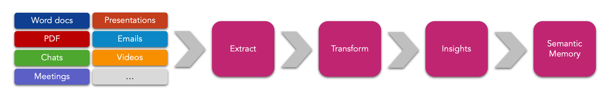
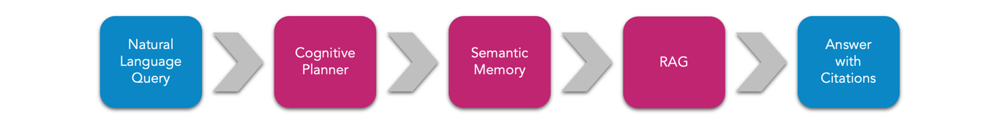
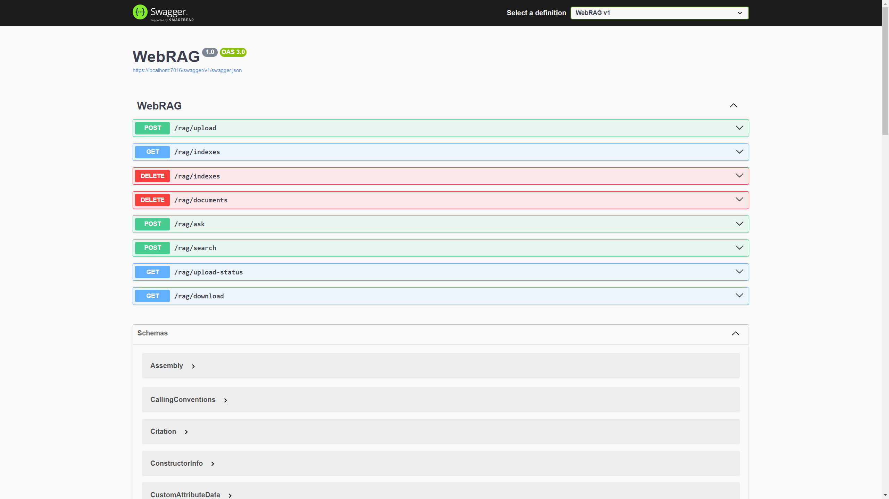
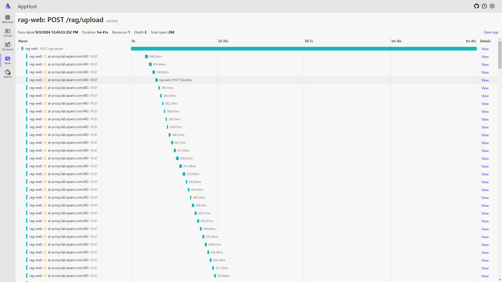
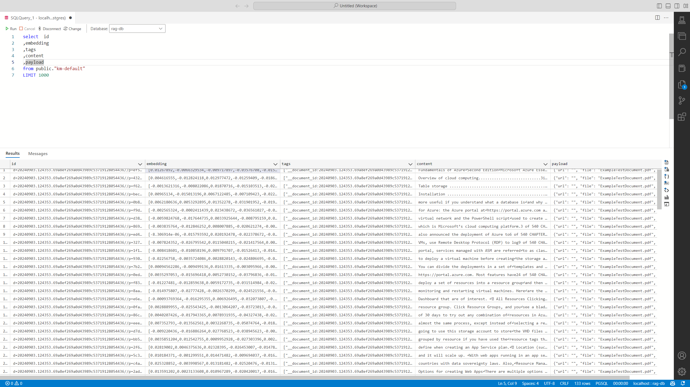
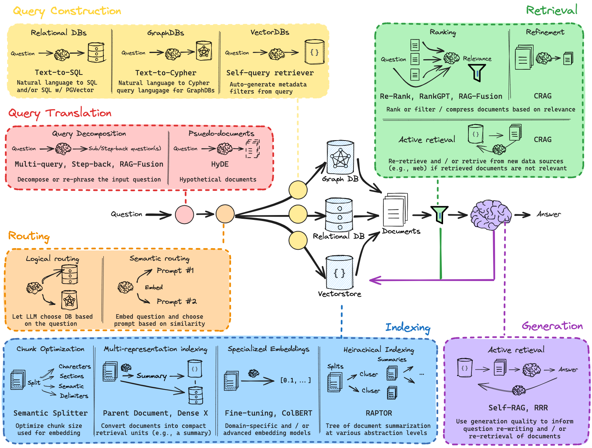

# Typical RAG implementation using Kernel Memory and Aspire

This repository contains a source code of an example of a typical RAG implementation using out-of-the box solution based on `Microsoft.KernelMemory.Service.AspNetCore` package.

Here is how the ingestion pipeline looks like:



And here is what happens when you query the RAG solution:



Basically, all we need to do is to configure Semantic Memory and Semantic Kernel and then run the service.


```csharp
using Microsoft.KernelMemory;
using Microsoft.KernelMemory.Service.AspNetCore;
using Microsoft.SemanticKernel;

var builder = WebApplication.CreateBuilder(args);

// Configures Semantic Kernel
builder.Services.AddKernel().AddAzureOpenAIChatCompletion();

// Configures Semantic Memory
builder.Services.AddKernelMemory<MemoryServerless>(memoryBuilder =>
{
    memoryBuilder
        .WithPostgresMemoryDb()
        .WithAzureOpenAITextGeneration()
        .WithAzureOpenAITextEmbeddingGeneration();
});

var app = builder.Build();

// Maps various RAG endpoints
app.AddKernelMemoryEndpoints(apiPrefix: "/rag");
app.Run();
```

❕Note, the code abbreviated for simplicity.

Here is a list of endpoints that are available out-of-the-box:



## Demo


Run it:

```bash
dotnet run --project src/AppHost/
```

Let's upload a document called `AzureFundamentals.pdf` (8 MB) to the RAG pipeline.

```http
POST https://localhost:7016/rag/upload HTTP/1.1
accept: application/json
Content-Type: multipart/form-data; boundary=boundary

--boundary
Content-Disposition: form-data; name="file"; filename="AzureFundamentals.pdf"
Content-Type: pdf

< ./AzureFundamentals.pdf
--boundary--
```

Response:

```json
{
  "index": "",
  "documentId": "20240903.124353.69a8ef269a0d43989c53719128054436",
  "message": "Document upload completed, ingestion pipeline started"
}
```

It took about 1 minute to process the document. 



And about 133 partitions/embeddings were created.



Ask questions:

```bash
curl -X 'POST' \
    'https://localhost:7016/rag/ask' \
    -H 'accept: application/json' \
    -H 'Content-Type: application/json' \
    -d '{ "question": "What kind of Azure Database services can I use?" }'
```

```json
{
  "question": "What kind of Azure Database services can I use?",
  "noResult": false,
  "text": "Azure offers a variety of database services to cater to different needs, including both SQL and NoSQL options:\n\n1. **Azure SQL Database**: This is a fully managed relational database with built-in intelligence that supports self-driving features such as performance tuning and threat alerts. Azure SQL Database is highly scalable and compatible with the SQL Server programming model.\n\n2. **SQL Server on Azure Virtual Machines**: This service allows you to run SQL Server inside a fully managed virtual machine in the cloud. It is suitable for applications that require a high level of control over the database server and compatibility with SQL Server data management and business intelligence capabilities.\n\n3. **Azure Cosmos DB**: Formerly known as DocumentDB, Azure Cosmos DB is a globally distributed, multi-model database service. It is designed to provide low-latency, scalable, and highly available access to your data, suitable for any scale of business application.\n\n4. **Azure Database for MySQL**: This is a managed service that enables you to run, manage, and scale highly available MySQL databases in the cloud. Using Azure Database for MySQL provides capabilities such as high availability, security, and recovery built into the service.\n\n5. **Azure Database for PostgreSQL**: Similar to Azure Database for MySQL, this service provides a fully managed, scalable PostgreSQL database service with high availability and security features.\n\n6. **Azure Table Storage**: A service that stores large amounts of structured NoSQL data in the cloud, providing a key/attribute store with a schema-less design. This service is highly",
  "relevantSources": [
    {
      "link": "default/20240903.124353.69a8ef269a0d43989c53719128054436/9b7accc78c164db7a2a630ca57e38d8f",
      "index": "default",
      "documentId": "20240903.124353.69a8ef269a0d43989c53719128054436",
      "fileId": "9b7accc78c164db7a2a630ca57e38d8f",
      "sourceContentType": "application/pdf",
      "sourceName": "ExampleTestDocument.pdf",
      "sourceUrl": "/download?index=default&documentId=20240903.124353.69a8ef269a0d43989c53719128054436&filename=ExampleTestDocument.pdf",
      "partitions": [
        {
          "text": "",
          "relevance": 0.8672107,
          "partitionNumber": 99,
          "sectionNumber": 0,
          "lastUpdate": "2024-09-03T09:45:34+03:00",
          "tags": {
            "__document_id": [
              "20240903.124353.69a8ef269a0d43989c53719128054436"
            ],
            "__file_type": ["application/pdf"],
            "__file_id": ["9b7accc78c164db7a2a630ca57e38d8f"],
            "__file_part": ["1999e1ab04a24174bf6d2c79284b04b5"],
            "__part_n": ["99"],
            "__sect_n": ["0"]
          }
        }
      ]
    }
  ]
}
```

## General Architecture

Here is a diagram that shows various components of RAG architecture. As you can see there are many concepts that you may want to incorporate in your solution.




> [!TIP]
>  The demo above serves as good starting point, but for production scenario, I suggest to implement your own pipeline. Check out source code of `Microsoft.KernelMemory.Service.AspNetCore` - <https://github.com/microsoft/kernel-memory/blob/main/service/Service/Program.cs>.


## References

- <https://learn.microsoft.com/en-us/semantic-kernel/get-started/quick-start-guide?pivots=programming-language-csharp> - Semantic Kernel Getting Started
- <https://microsoft.github.io/kernel-memory/> - Semantic Memory Docs
- <https://www.deeplearning.ai/short-courses/langchain-chat-with-your-data/> - Chat with RAG
- <https://www.youtube.com/playlist?list=PLfaIDFEXuae2LXbO1_PKyVJiQ23ZztA0x> - RAG from Scratch
- <https://github.com/microsoft/semantic-kernel/blob/main/dotnet/docs/TELEMETRY.md> - OTel + SK
- <https://github.com/microsoft/semantic-kernel/tree/main/dotnet/samples/Demos/TelemetryWithAppInsights> - OTel + SK + AppInsights
